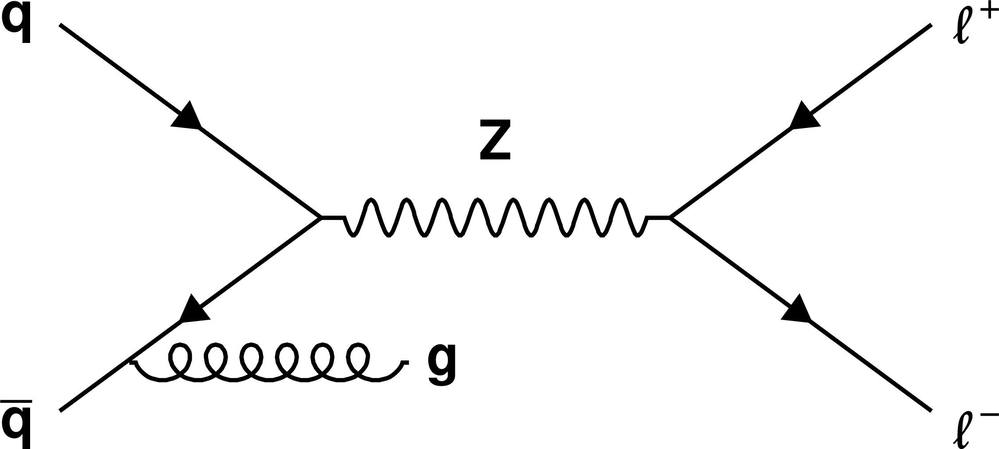
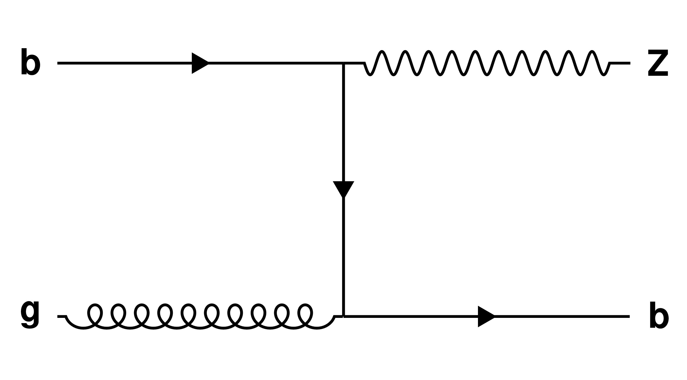
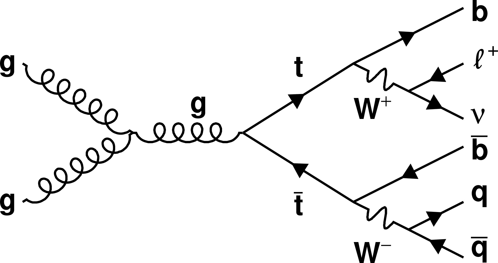
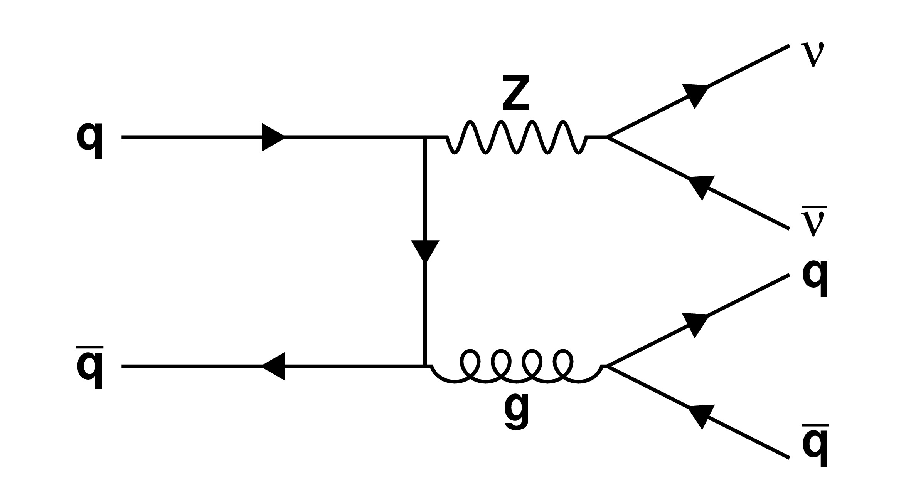
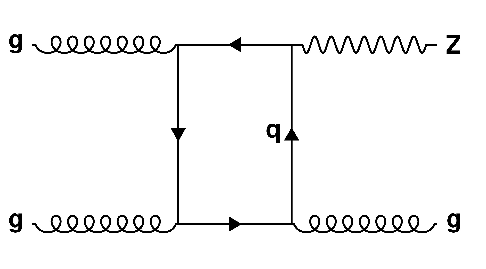

## feyn-ROOT

Draw Feynman diagrams with ROOT from python. Dependencies are pyROOT (`import ROOT`).
There are many basic diagrams available, you just need to tell which particles are involved.
For example, you can just run in the command line: `python3 simpleFeynman.py s "q" "#bar{q}" "Z" "#mu^{#plus}" "#mu^{#minus}"` and that will produce the s-channel production of a Z boson decaying to muons.

Note that we use ROOT's notation for [Greek/Math symbols](https://root.cern/root/html534/TLatex.html).
These are all the base diagrams that are available:
| Code | Diagram Name | Example |
|--------|--------|:------:|
| s | s-channel |    `python3 simpleFeynman.py s 'q' '#bar{q}' 'Z' '\ell^{+}' '\ell^{-}'`  |
| t | t-channel |     `python3 simpleFeynman.py t "b" "g" "-" "Z" "b"`    |
| sD | s-channel with one decay |      `python3 simpleFeynman.py sD "e^{#minus}" "e^{#plus}" "Z*" "Z" "h" "" "" "h" "h"`   |
| sDD | s-channel with two decays |     `python3 simpleFeynman.py sDD 'g' 'g' 'g' 't' '#bar{t}' 'b' 'W^{#plus}' '#bar{b}' 'W^{#minus}' '\ell^{+}' '#nu' 'q' '#bar{q}'`    |
| tD | t-channel with one or two decays |     `python3 simpleFeynman.py tD q "#bar{q}" "-" "Z" "g" "#nu" "#bar{#nu}" "q" "#bar{q}"`  |
| Hgg | Higgs gluon-gluon fusion |     `python3 simpleFeynman.py Hgg Z Z`    |
| VBF | Vector-Boson fusion |     `python3 simpleFeynman.py VBF "q" "q'" "W/Z" "W/Z" "q" "q'" "h"`   |
| BOX | Box diagram |     `python3 simpleFeynman.py BOX "g" "g" "-" "Z" "g" "-" "-" "q"`    |
| TripleT | Triple t-channel |     `python3 simpleFeynman.py TripleT g g "#bar{q}" "#Phi" "#bar{q}" q q "#chi" "#chi"`   |

### Existing examples:
There are three folders with some examples: `SM/SM.sh`, `Higgs/Higgs.sh`, `DM/DM.sh`, and `SVJ/SVJ.sh`.
You can run each of them, for example like: `cd SM; source SM.sh` to produce all the plots there and give each pdf file a proper name.

There are options to draw slanted lines (`angle=True`), vertices with symbols (`vtx=True`), and other customizations in particular diagrams, but those typically need to edit the code in `simpleFeynman.py` for that particular case. Or one can run, for example, something like:
`python3 -c "from simpleFeynman import *; simpleSCh('q','#bar{q}','V','#chi','#bar{#chi}',ISR='g')"`
to add an ISR gluon to the s-channel diagram.

Note that the use of `\ell` in ROOT is fraught with issues. If you want to use `\ell` in one of the legs, you will then need to run epstopdf to convert the resulting eps file to pdf. This linux script is available by installing `sudo apt install texlive-font-utils`.

