# Feynman Diagram Gallery

| Diagram | Diagram | Diagram |
|---|---|---|
| 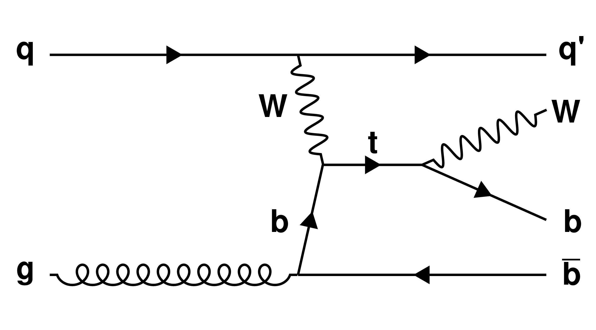 `python3 ../simpleFeynman.py VBF "q" "g" "W" "b" "q'" "#bar{b}" "t" "W" "b"` [PDF](st-tchan.pdf) | 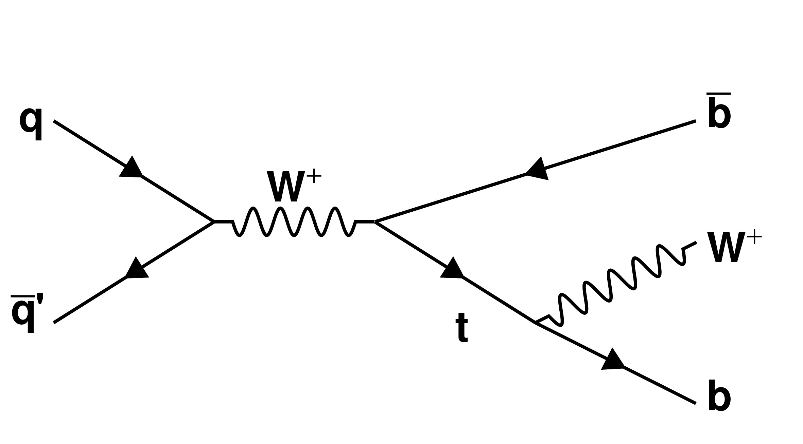 `python3 ../simpleFeynman.py sD "q" "#bar{q}'" "W^{#plus}" "#bar{b}" "t" "--" "--" "W^{#plus}" "b"` [PDF](st-schan.pdf) | 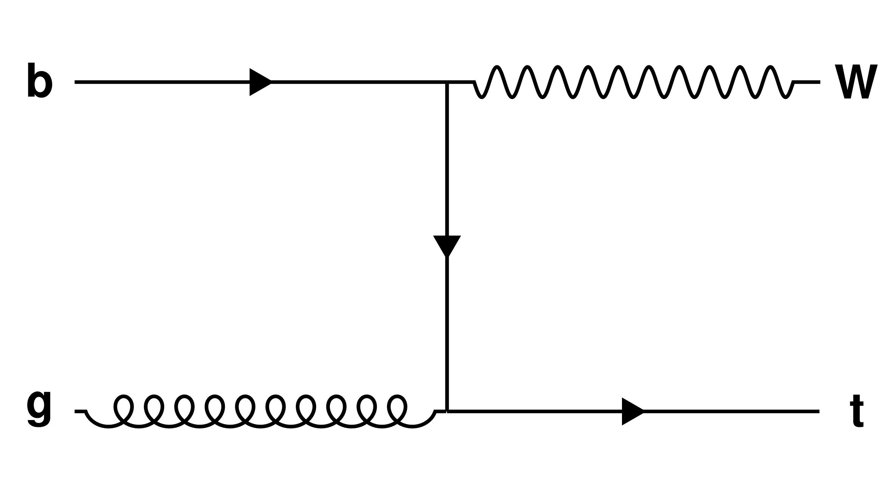 `python3 ../simpleFeynman.py t "b" "g" "-" "W" "t"` [PDF](st-tWchan.pdf) |
| 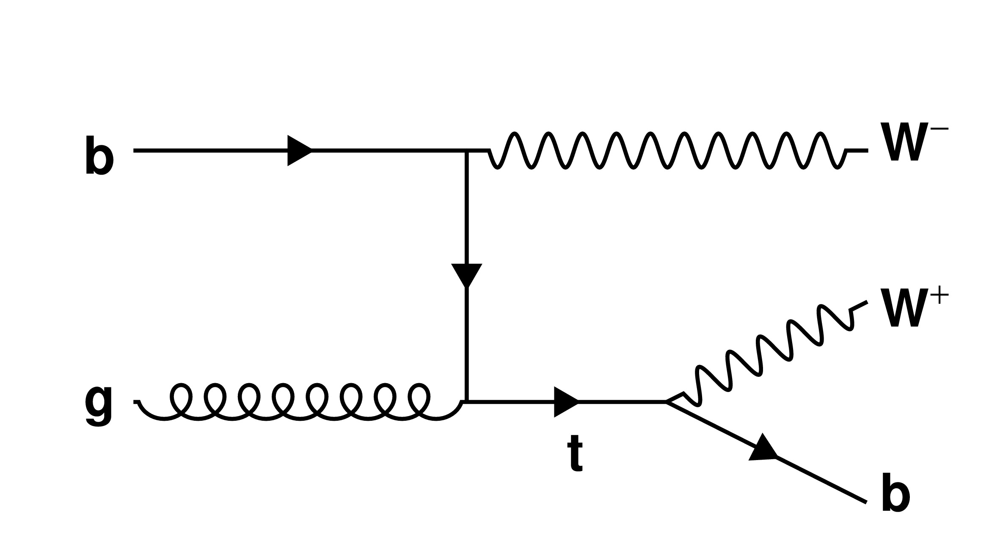 `python3 ../simpleFeynman.py tD "b" "g" "-" "W^{#minus}" "t" "--" "--" "W^{#plus}" "b"` [PDF](st-tWchan_decayWb.pdf) |  `python3 ../simpleFeynman.py sDD 'g' 'g' 'g' 't' '#bar{t}' 'b' 'W^{#plus}' '#bar{b}' 'W^{#minus}' '\ell^{+}' '#nu' 'q' '#bar{q}'` [PDF](TTbar_lnuJets.pdf) | 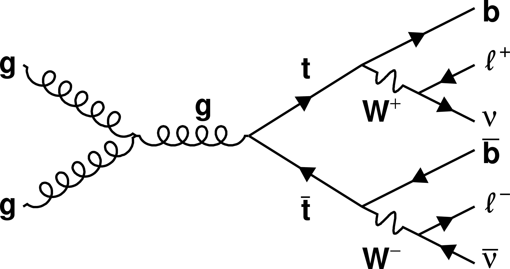 `python3 ../simpleFeynman.py sDD 'g' 'g' 'g' 't' '#bar{t}' 'b' 'W^{#plus}' '#bar{b}' 'W^{#minus}' '\ell^{+}' '#nu' '\ell^{-}' '#bar{#nu}'` [PDF](TTbar_lnulnu.pdf) |
| 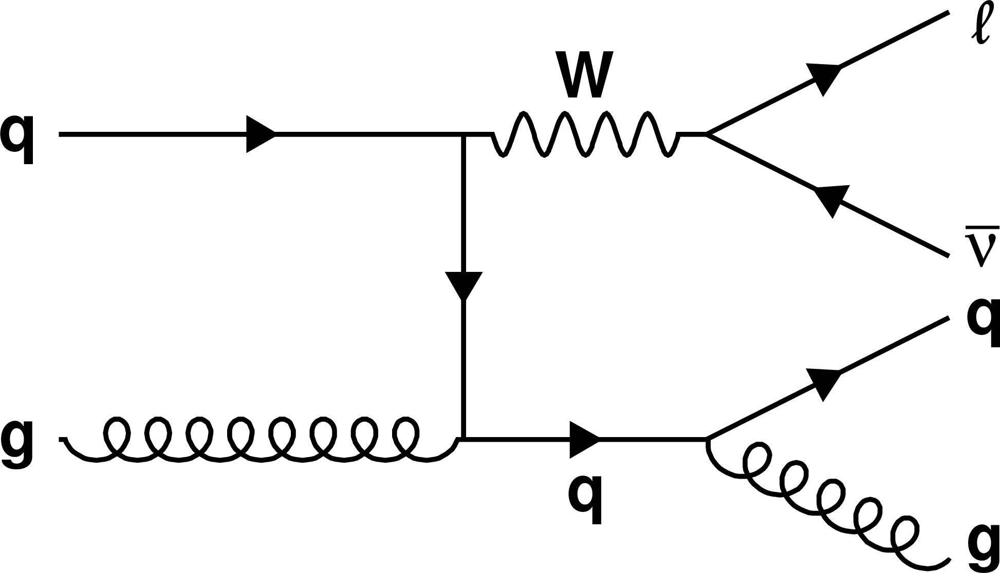 `python3 ../simpleFeynman.py tD 'q' 'g' '-' 'W' 'q'  '\ell' '#bar{#nu}' 'q' 'g'` [PDF](WJets.pdf) | 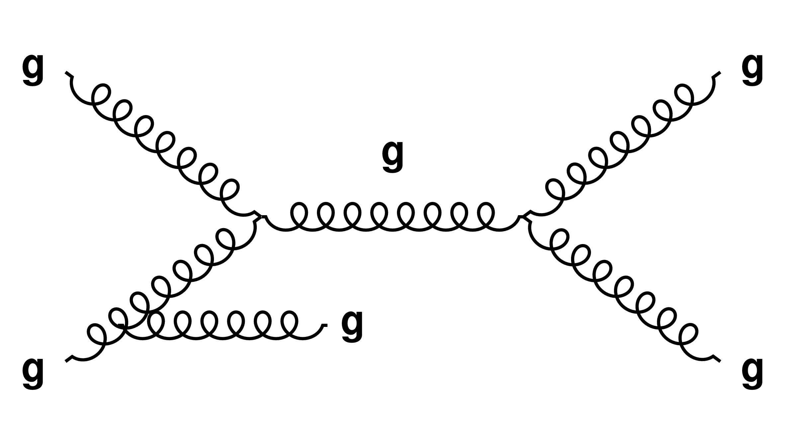 `python3 ../simpleFeynman.py s g g "g" "g" "g"` [PDF](QCD_dijet.pdf) |  `python3 ../simpleFeynman.py tD q "#bar{q}" "-" "Z" "g" "#nu" "#bar{#nu}" "q" "#bar{q}"` [PDF](ZplusJets_nunuJJ_decay.pdf) |
|  `python3 ../simpleFeynman.py s 'q' '#bar{q}' 'Z' '\ell^{+}' '\ell^{-}'` [PDF](DrellYan_qqZtoLL.pdf) | 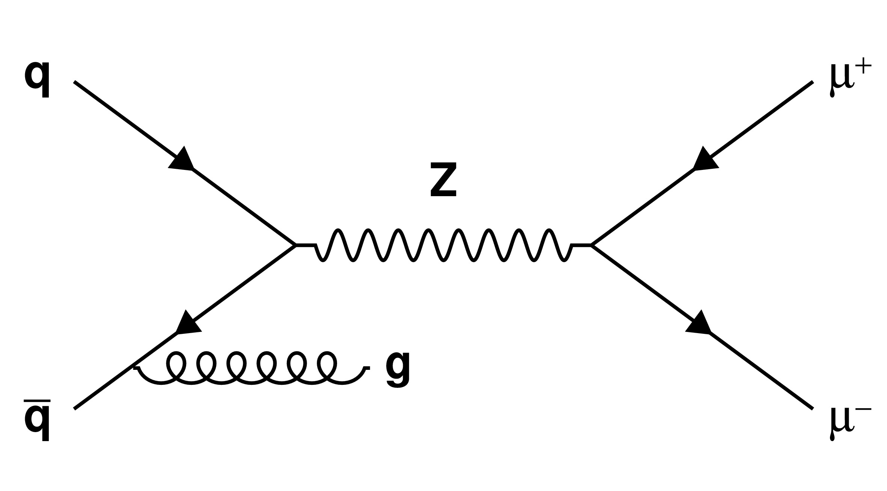 `python3 ../simpleFeynman.py s "q" "#bar{q}" "Z" "#mu^{#plus}" "#mu^{#minus}"` [PDF](DrellYan_qqZtoLLISR.pdf) |  `python3 ../simpleFeynman.py BOX "g" "g" "-" "Z" "g" "-" "-" "q"` [PDF](Zjets_gg-BOX-Zg.pdf) |
| 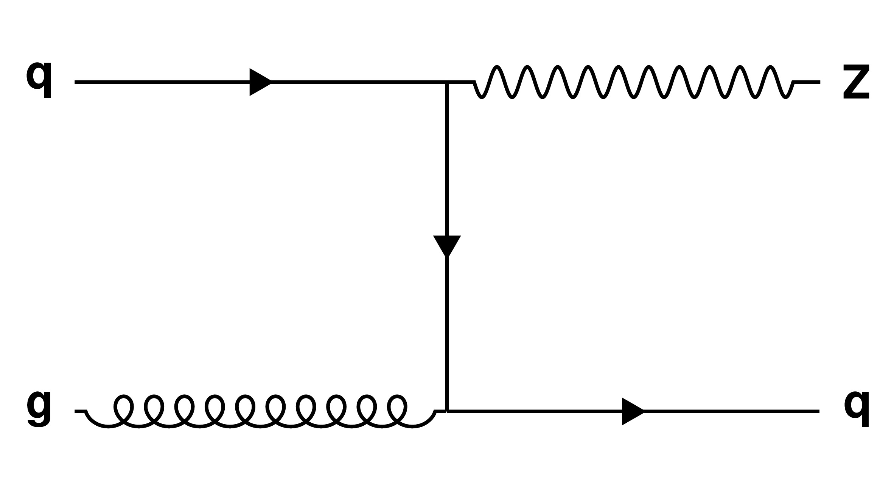 `python3 ../simpleFeynman.py t "q" "g" "-" "Z" "q"` [PDF](Zjets_qg-Zq.pdf) |  `python3 ../simpleFeynman.py t "b" "g" "-" "Z" "b"` [PDF](Zjets_bg-Zb.pdf) | 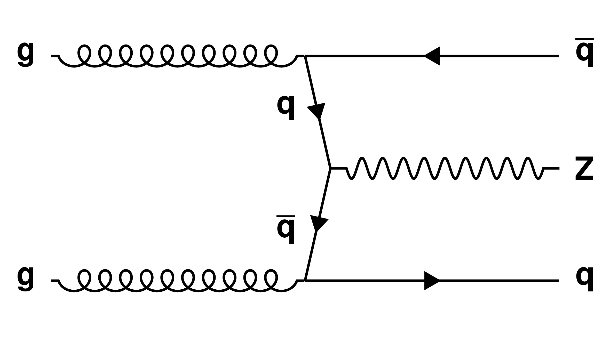 `python3 ../simpleFeynman.py VBF "g" "g" "q" "#bar{q}" "#bar{q}" "q" "Z"` [PDF](Zjets_gg-ZqqVBF.pdf) |
| 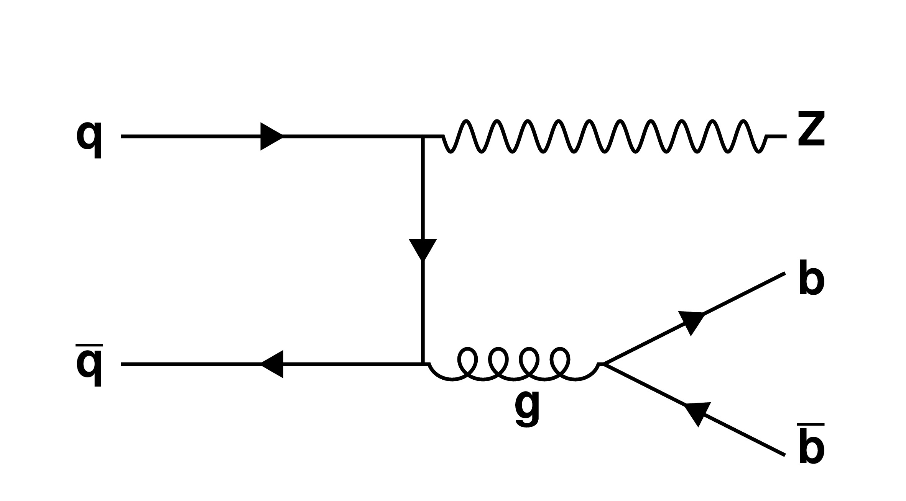 `python3 ../simpleFeynman.py tD q "#bar{q}" "-" "Z" "g" "--" "--" "b" "#bar{b}"` [PDF](ZJets_qq-Zbb_decay.pdf) |  |  |
