# Feynman Diagram Gallery

| Diagram | Diagram | Diagram |
|---|---|---|
| 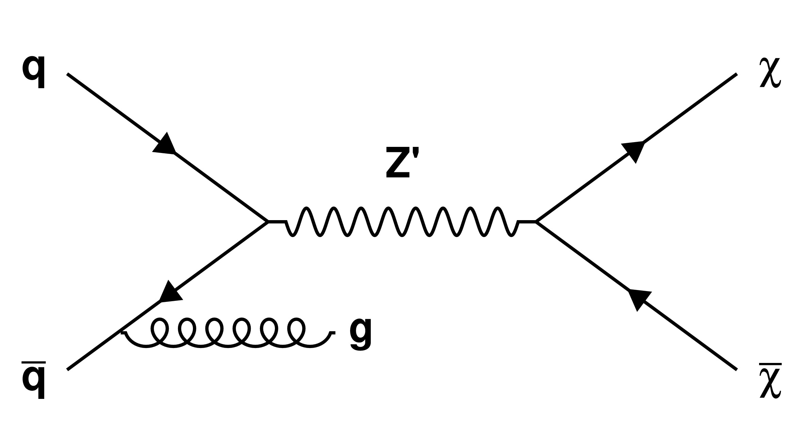 `python3 simpleFeynman.py s q "#bar{q}" "Z'" "#chi" "#bar{#chi}"` [PDF](SVJ_qq_Zp_schannel.pdf) | 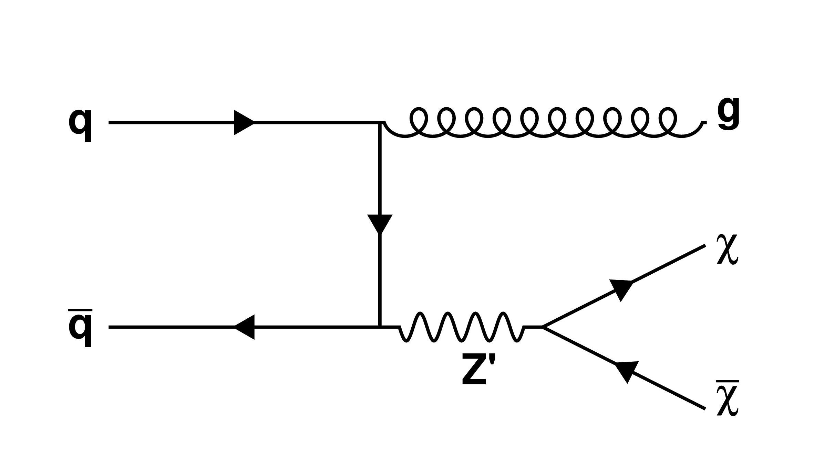 `python3 simpleFeynman.py tD q "#bar{q}" "-" "g" "Z'" "--" "--" "#chi" "#bar{#chi}"` [PDF](SVJ_qq_Zpg_tchannel.pdf) | 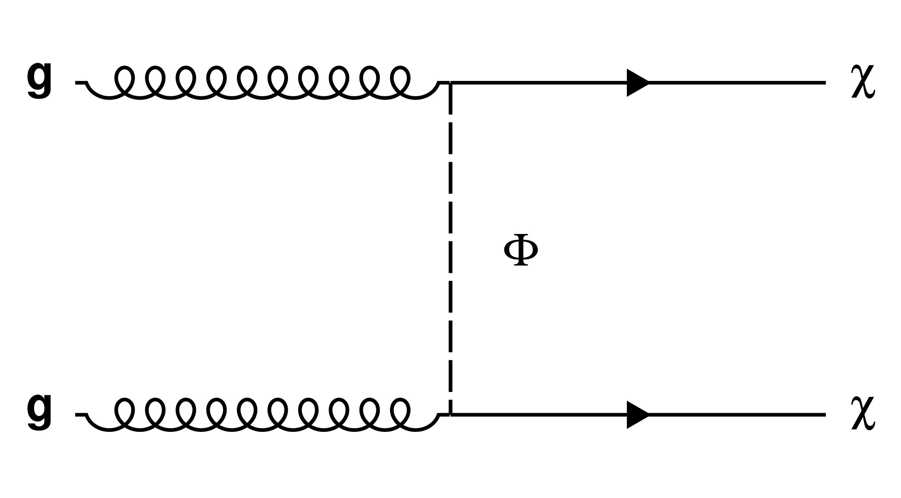 `python3 simpleFeynman.py t g g "#Phi" "#chi" "#chi"` [PDF](SVJ_gg_ChiChi_tchannel.pdf) |
| 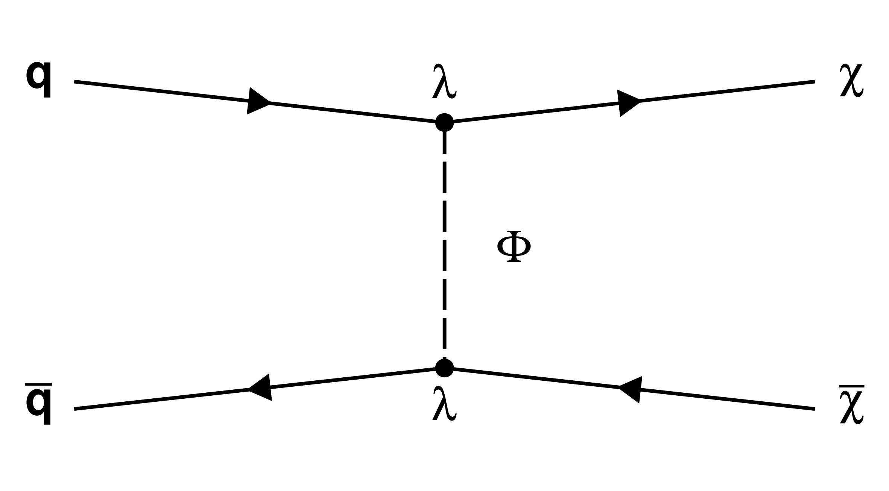 `python3 simpleFeynman.py t q "#bar{q}" "#Phi" "#chi" "#bar{#chi}"` [PDF](SVJ_qq_ChiChi_tchannel.pdf) | 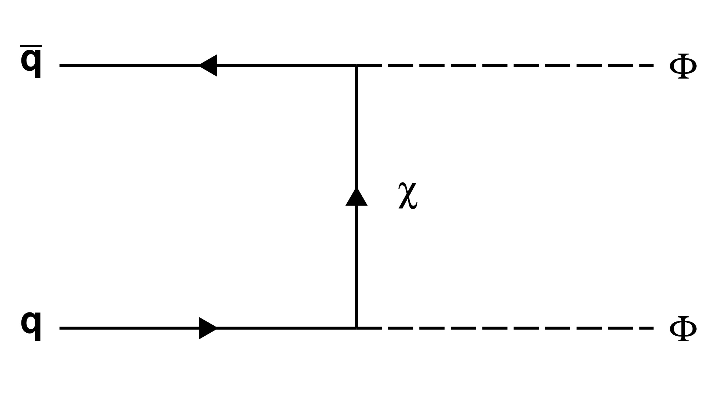 `python3 simpleFeynman.py t "#bar{q}" "q" "#chi" "#Phi" "#Phi"` [PDF](SVJ_qq_PhiPhi_tchannel.pdf) | 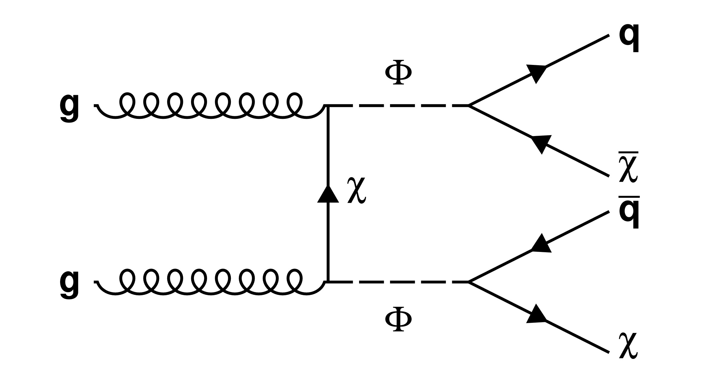 `python3 simpleFeynman.py tD g g "#chi" "#Phi" "#Phi" "q" "#bar{#chi}" "#bar{q}" "#chi"` [PDF](SVJ_gg_PhiPhi_tchannel_Decay.pdf) |
| 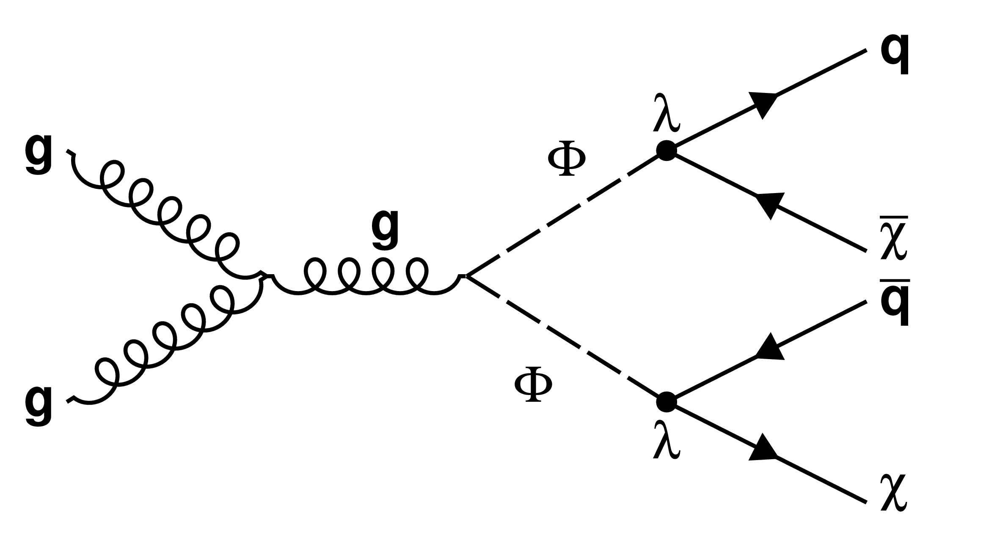 `python3 simpleFeynman.py sD g g g "#Phi" "#Phi" q "#bar{#chi}" "#bar{q}" "#chi"` [PDF](SVJ_gg_PhiPhi_schannel_Decay.pdf) | 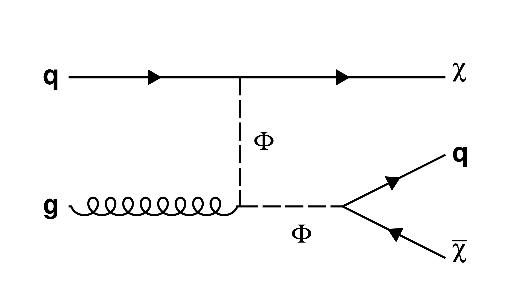 `python3 simpleFeynman.py tD q g "#Phi" "#chi" "#Phi" "--" "--" "q" "#bar{#chi}"` [PDF](SVJ_qg_PhiChi_tchannel_Decay.pdf) | 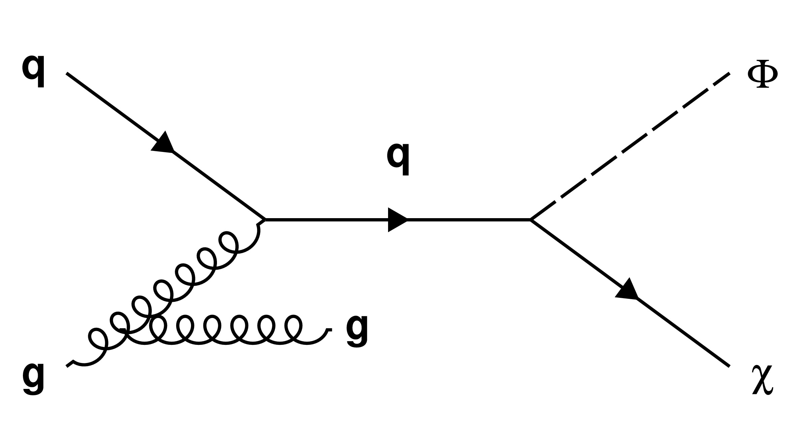 `python3 simpleFeynman.py s q g "q" "#Phi" "#chi"` [PDF](SVJ_qg_PhiChi_schannel.pdf) |
| 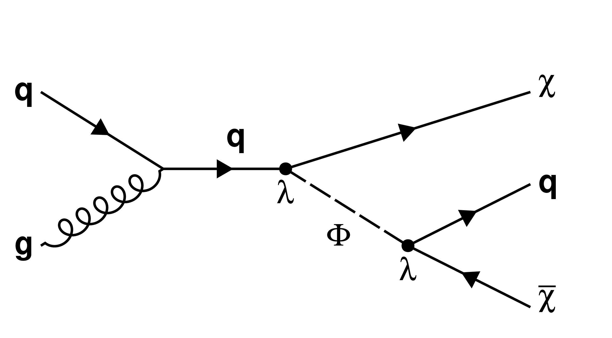 `python3 simpleFeynman.py sD q g "q" "#chi" "#Phi" "--" "--" q "#bar{#chi}"` [PDF](SVJ_qg_PhiChi_schannel_Decay.pdf) | 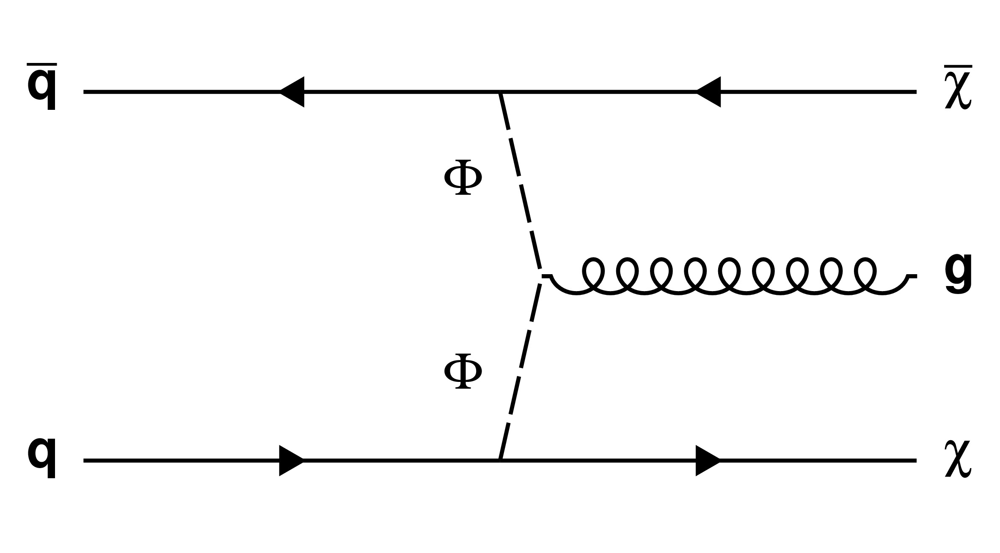 `python3 simpleFeynman.py VBF "#bar{q}" q "#Phi" "#Phi" "#bar{#chi}" "#chi" g` [PDF](SVJ_qq_ChigChi_tchannel.pdf) | 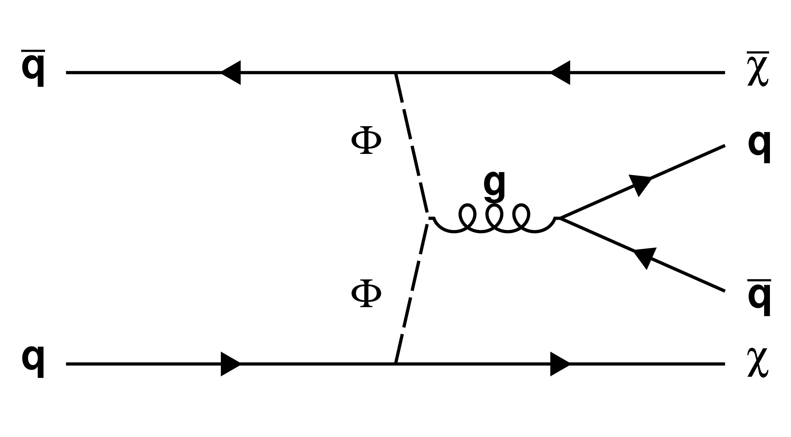 `python3 simpleFeynman.py VBF "#bar{q}" q "#Phi" "#Phi" "#bar{#chi}" "#chi" g q "#bar{q}"` [PDF](SVJ_qq_ChiChiqq_VBF_Decay.pdf) |
| 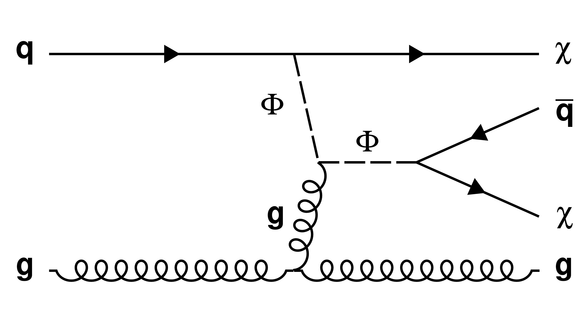 `python3 simpleFeynman.py VBF q g "#Phi" g "#chi" g "#Phi" "#bar{q}" "#chi"` [PDF](SVJ_qg_ChiChiqg_VBF_Decay.pdf) | 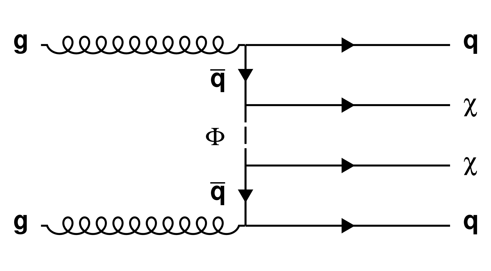 `python3 simpleFeynman.py TripleT g g "#bar{q}" "#Phi" "#bar{q}" q q "#chi" "#chi"` [PDF](SVJ_gg_ChiChiqq_TripleT.pdf) |  |